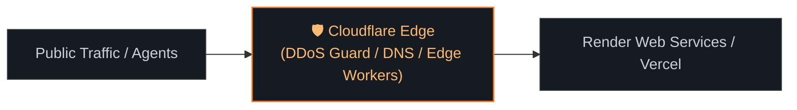

# 🛡️ Cloudflare ক্লাউড সার্ভিস আর্কিটেকচার

- **ক্যাটাগরি:** Edge Network, DNS & DDoS Protection
- **ব্যবহার:** সেন্ট্রাল এজ প্রক্সি, সিকিউরিটি শিল্ড ও ক্লাউডফ্লেয়ার ওয়ার্কার্স

```mermaid
flowchart LR
    classDef svc fill:#161b22,stroke:#f97316,stroke-width:1.5px,color:#fdba74;
    classDef gate fill:#161b22,stroke:#30363d,stroke-width:1px,color:#c9d1d9;

    Users["Public Traffic / Agents"] --> CF["🛡️ Cloudflare Edge<br/>(DDoS Guard / DNS / Edge Workers)"]
    CF --> Backends["Render Web Services / Vercel"]

    class Users,Backends gate;
    class CF svc;
```

