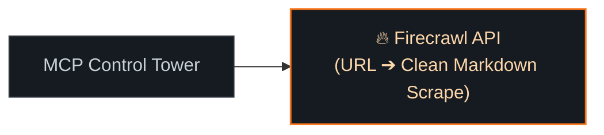

# 🔥 Firecrawl সার্ভিস আর্কিটেকচার

- **ক্যাটাগরি:** Automated Web Scraping & Markdown Converter
- **ব্যবহার:** যেকোনো ওয়েব ডকুমেন্টেশন ও গাইডকে সরাসরি ক্লিন মার্কডাউনে রূপান্তর করা

```mermaid
flowchart LR
    classDef svc fill:#161b22,stroke:#f97316,stroke-width:1.5px,color:#fed7aa;
    classDef gate fill:#161b22,stroke:#30363d,stroke-width:1px,color:#c9d1d9;

    Tower["MCP Control Tower"] --> Firecrawl["🔥 Firecrawl API<br/>(URL ➔ Clean Markdown Scrape)"]

    class Tower gate;
    class Firecrawl svc;
```

