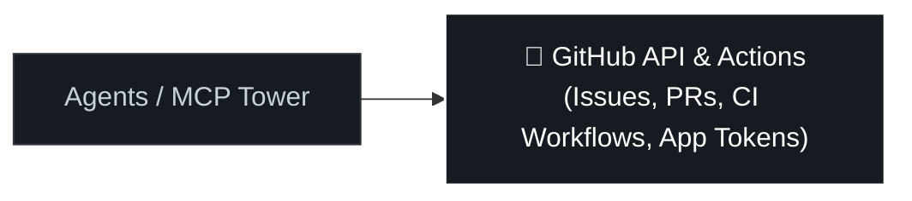

# 🐙 GitHub সার্ভিস আর্কিটেকচার

- **ক্যাটাগরি:** Source Control, Issue Tracking & CI/CD Actions
- **ব্যবহার:** রিপোজিটরি হোস্ট, ইস্যু বোর্ড, GitHub Actions এবং GitHub App installation tokens

```mermaid
flowchart LR
    classDef svc fill:#161b22,stroke:#ffffff,stroke-width:1.5px,color:#ffffff;
    classDef gate fill:#161b22,stroke:#30363d,stroke-width:1px,color:#c9d1d9;

    Agents["Agents / MCP Tower"] --> GitHub["🐙 GitHub API & Actions<br/>(Issues, PRs, CI Workflows, App Tokens)"]

    class Agents gate;
    class GitHub svc;
```

