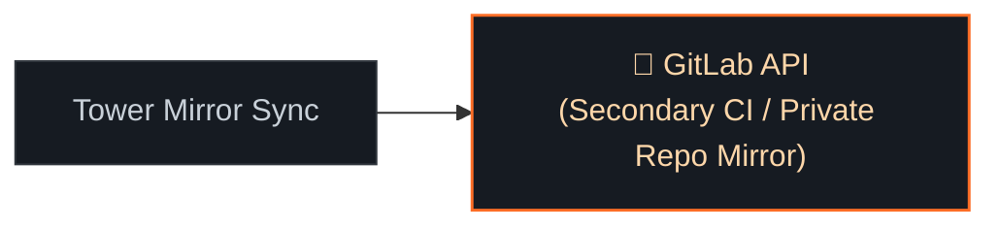

# 🦊 GitLab সার্ভিস আর্কিটেকচার

- **ক্যাটাগরি:** Secondary Mirror & External CI Backup
- **ব্যবহার:** সেকেন্ডারি মিররিং ও সেলফ-হোস্টেড রানার ব্যাকআপ

```mermaid
flowchart LR
    classDef svc fill:#161b22,stroke:#fc6d26,stroke-width:1.5px,color:#fed7aa;
    classDef gate fill:#161b22,stroke:#30363d,stroke-width:1px,color:#c9d1d9;

    Sync["Tower Mirror Sync"] --> GitLab["🦊 GitLab API<br/>(Secondary CI / Private Repo Mirror)"]

    class Sync gate;
    class GitLab svc;
```

