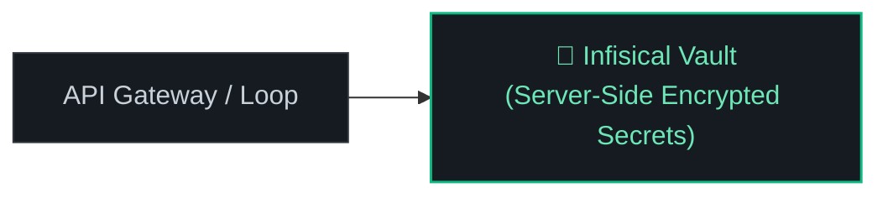

# 🔐 Infisical সিক্রেটস ভল্ট আর্কিটেকচার

- **ক্যাটাগরি:** Centralized Secrets Management & Zero-Leak Vault
- **ব্যবহার:** সমস্ত থার্ড-পার্টি API কি ও ডেটাবেজ ক্রেডেনশিয়াল সুরক্ষিত রাখা

```mermaid
flowchart LR
    classDef svc fill:#161b22,stroke:#10b981,stroke-width:1.5px,color:#6ee7b7;
    classDef gate fill:#161b22,stroke:#30363d,stroke-width:1px,color:#c9d1d9;

    Apps["API Gateway / Loop"] --> Infisical["🔐 Infisical Vault<br/>(Server-Side Encrypted Secrets)"]

    class Apps gate;
    class Infisical svc;
```

