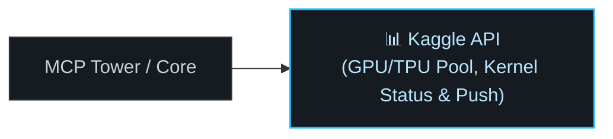

# 📊 Kaggle সার্ভিস আর্কিটেকচার

- **ক্যাটাগরি:** Distributed GPU/TPU Training & Kernel Runner
- **ব্যবহার:** হেভি এআই ট্রেনিং, মডেল ইভালুয়েশন ও কার্নেল পুশ/এক্সিকিউশন

```mermaid
flowchart LR
    classDef svc fill:#161b22,stroke:#20beff,stroke-width:1.5px,color:#bae6fd;
    classDef gate fill:#161b22,stroke:#30363d,stroke-width:1px,color:#c9d1d9;

    Tower["MCP Tower / Core"] --> Kaggle["📊 Kaggle API<br/>(GPU/TPU Pool, Kernel Status & Push)"]

    class Tower gate;
    class Kaggle svc;
```

