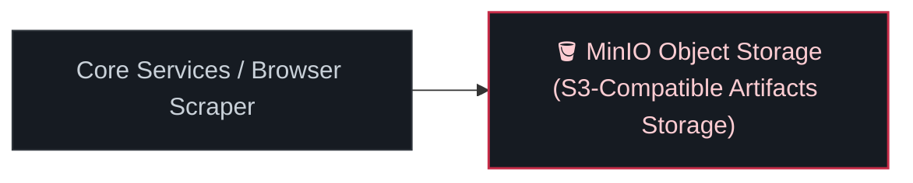

# 🪣 MinIO সার্ভিস আর্কিটেকচার

- **ক্যাটাগরি:** S3-Compatible Object Storage
- **ব্যবহার:** আর্টিফ্যাক্টস, টেস্ট লগস, স্ক্রিনশট ও মিডিয়া স্টোরেজ

```mermaid
flowchart LR
    classDef svc fill:#161b22,stroke:#c72c48,stroke-width:1.5px,color:#fecdd3;
    classDef gate fill:#161b22,stroke:#30363d,stroke-width:1px,color:#c9d1d9;

    Core["Core Services / Browser Scraper"] --> MinIO["🪣 MinIO Object Storage<br/>(S3-Compatible Artifacts Storage)"]

    class Core gate;
    class MinIO svc;
```

