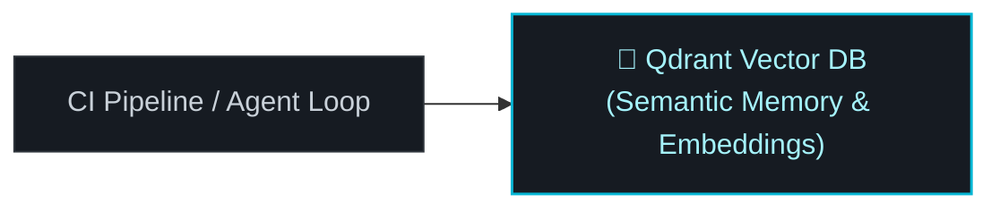

# 🎯 Qdrant / Vector DB সার্ভিস আর্কিটেকচার

- **ক্যাটাগরি:** Vector Database & Semantic Retrieval
- **ব্যবহার:** মার্জড PR ডিফ সংরক্ষণ, এজেন্ট সেমান্টিক মেমোরি ও ডকুমেন্ট সার্চ

```mermaid
flowchart LR
    classDef svc fill:#161b22,stroke:#06b6d4,stroke-width:1.5px,color:#a5f3fc;
    classDef gate fill:#161b22,stroke:#30363d,stroke-width:1px,color:#c9d1d9;

    Pipeline["CI Pipeline / Agent Loop"] --> Qdrant["🎯 Qdrant Vector DB<br/>(Semantic Memory & Embeddings)"]

    class Pipeline gate;
    class Qdrant svc;
```

