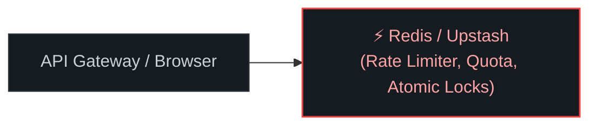

# ⚡ Redis / Upstash সার্ভিস আর্কিটেকচার

- **ক্যাটাগরি:** In-Memory Cache & Message Queue
- **ব্যবহার:** সেন্ট্রাল রেট-লিমিটিং, কোটা কাউন্টার এবং ডিস্ট্রিবিউটেড লক

```mermaid
flowchart LR
    classDef svc fill:#161b22,stroke:#ef4444,stroke-width:1.5px,color:#fca5a5;
    classDef gate fill:#161b22,stroke:#30363d,stroke-width:1px,color:#c9d1d9;

    Services["API Gateway / Browser"] --> Redis["⚡ Redis / Upstash<br/>(Rate Limiter, Quota, Atomic Locks)"]

    class Services gate;
    class Redis svc;
```

