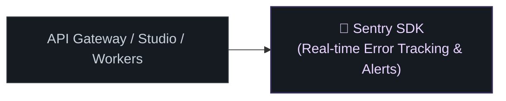

# 🚨 Sentry সার্ভিস আর্কিটেকচার

- **ক্যাটাগরি:** Application Error Tracking & Performance Monitoring
- **ব্যবহার:** ব্যাকএন্ড ও ফ্রন্টএন্ডের আনহ্যান্ডেলড এক্সেপশন ও ক্র্যাশ রিপোর্টিং

```mermaid
flowchart LR
    classDef svc fill:#161b22,stroke:#362d59,stroke-width:1.5px,color:#e9d5ff;
    classDef gate fill:#161b22,stroke:#30363d,stroke-width:1px,color:#c9d1d9;

    Apps["API Gateway / Studio / Workers"] --> Sentry["🚨 Sentry SDK<br/>(Real-time Error Tracking & Alerts)"]

    class Apps gate;
    class Sentry svc;
```

