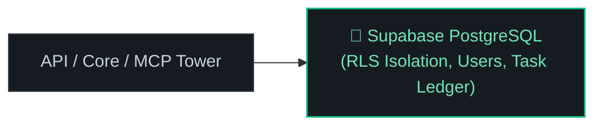

# 🐘 Supabase সার্ভিস আর্কিটেকচার

- **ক্যাটাগরি:** Central Cloud Relational Database & Auth
- **ব্যবহার:** PostgreSQL ডেটাবেজ, RLS টেন্যান্ট আইসোলেশন ও সেন্ট্রাল মেম্বারশিপ লেজার

```mermaid
flowchart LR
    classDef svc fill:#161b22,stroke:#10b981,stroke-width:1.5px,color:#6ee7b7;
    classDef gate fill:#161b22,stroke:#30363d,stroke-width:1px,color:#c9d1d9;

    Services["API / Core / MCP Tower"] --> Supabase["🐘 Supabase PostgreSQL<br/>(RLS Isolation, Users, Task Ledger)"]

    class Services gate;
    class Supabase svc;
```

