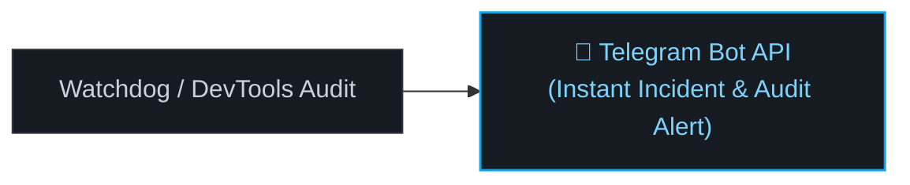

# 📱 Telegram Bot সার্ভিস আর্কিটেকচার

- **ক্যাটাগরি:** Automated Incident Alerting & DevTools Reporting
- **ব্যবহার:** সিস্টেম এরর, CI ফেইলিউর এবং DevTools অডিট রিপোর্ট সরাসরি ডেলিভারি করা

```mermaid
flowchart LR
    classDef svc fill:#161b22,stroke:#0ea5e9,stroke-width:1.5px,color:#7dd3fc;
    classDef gate fill:#161b22,stroke:#30363d,stroke-width:1px,color:#c9d1d9;

    AuditWatchdog["Watchdog / DevTools Audit"] --> Telegram["📱 Telegram Bot API<br/>(Instant Incident & Audit Alert)"]

    class AuditWatchdog gate;
    class Telegram svc;
```

