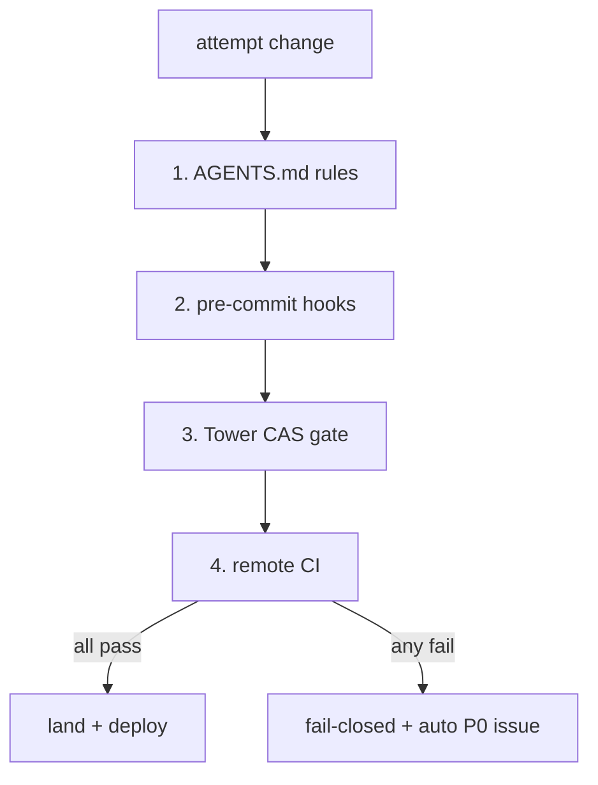

# Guards

```mermaid
flowchart TD
    A[attempt change] --> T1[1. AGENTS.md rules]
    T1 --> T2[2. pre-commit hooks]
    T2 --> T3[3. Tower CAS gate]
    T3 --> T4[4. remote CI]
    T4 -->|all pass| OK[land + deploy]
    T4 -->|any fail| FAIL[fail-closed + auto P0 issue]
```
