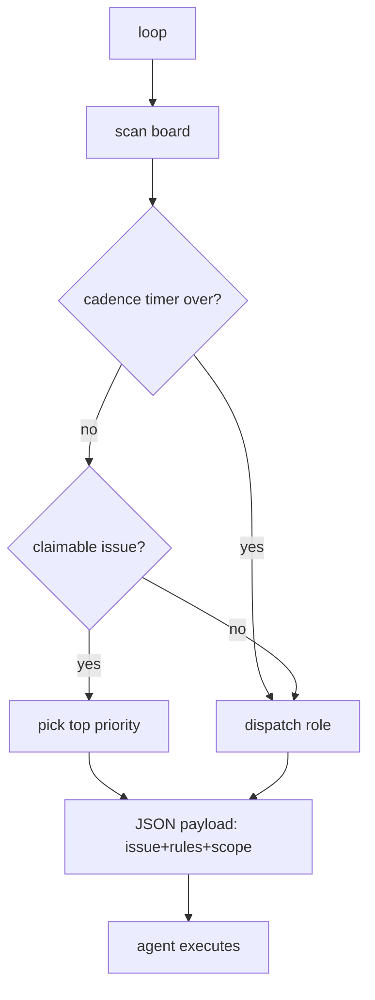

# Loop Decision

```mermaid
flowchart TD
    L[loop] --> S[scan board]
    S --> C{cadence timer over?}
    C -- yes --> ROLE[dispatch role]
    C -- no --> E{claimable issue?}
    E -- yes --> TOP[pick top priority]
    E -- no --> ROLE
    TOP --> PAYLOAD[JSON payload: issue+rules+scope]
    ROLE --> PAYLOAD
    PAYLOAD --> AGENT[agent executes]
```
