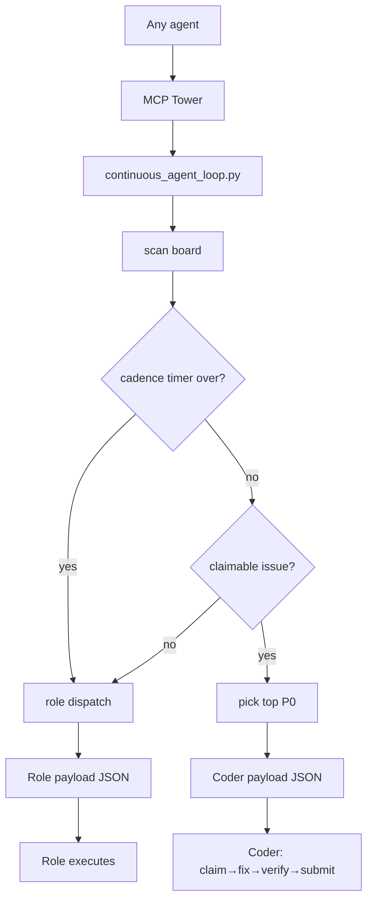
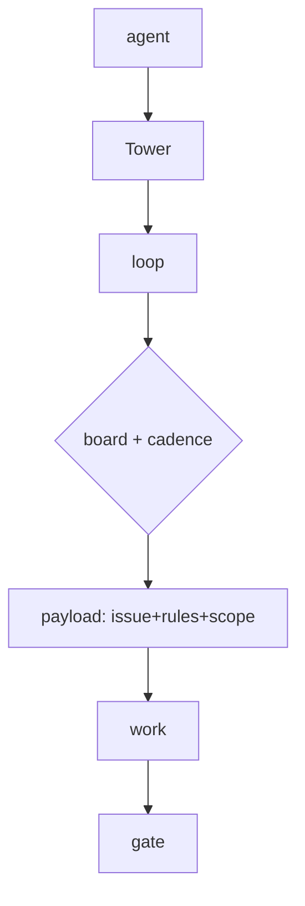

# 01 Agent Loop & Dispatch

## Current

```mermaid
flowchart TD
    EXT[Any agent] --> T[MCP Tower]
    T --> L[continuous_agent_loop.py]
    L --> S[scan board]
    S --> C{cadence timer over?}
    C -- yes --> R[role dispatch]
    C -- no --> I{claimable issue?}
    I -- yes --> P[pick top P0]
    I -- no --> R
    P --> CP[Coder payload JSON]
    R --> RP[Role payload JSON]
    CP --> CA[Coder: claim→fix→verify→submit]
    RP --> RA[Role executes]
```

## Simple

```mermaid
flowchart TD
    A[agent] --> T[Tower] --> L[loop]
    L --> D{board + cadence}
    D --> X[payload: issue+rules+scope]
    X --> W[work]
    W --> G[gate]
```
Collapse coder/role branches into one payload+work path; dispatch decision lives only in the loop.
