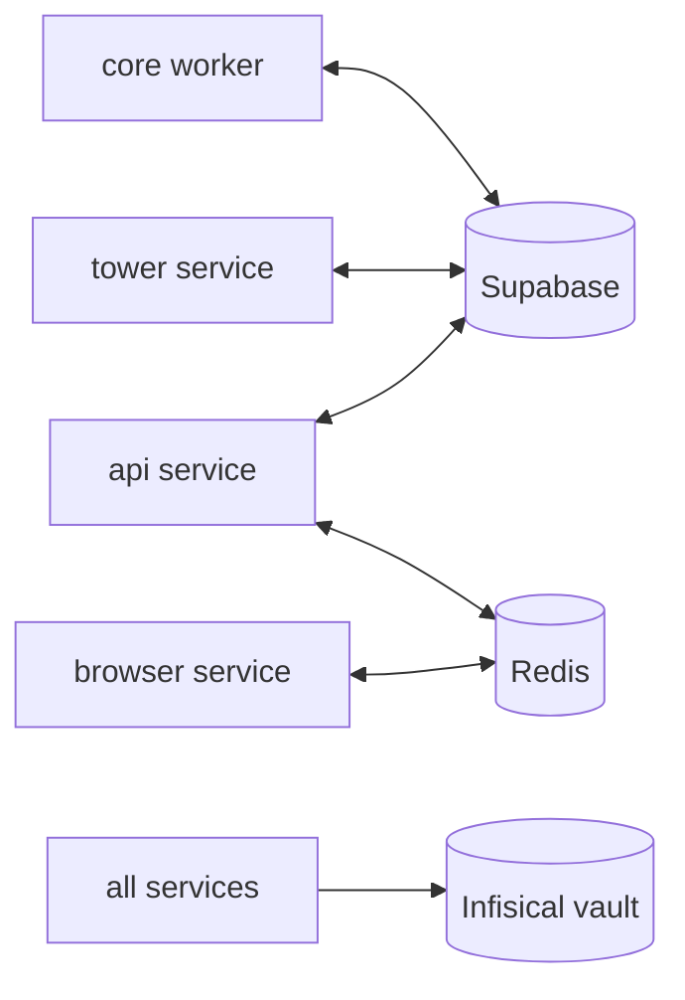
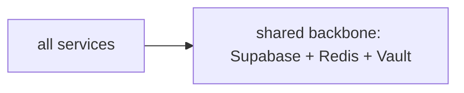

# 07 Backbone (Data & Infra)

## Current

```mermaid
flowchart LR
    API[api service] <--> SB[(Supabase)]
    TOWER[tower service] <--> SB
    CORE[core worker] <--> SB
    BROWSER[browser service] <--> RD[(Redis)]
    API <--> RD
    ALL[all services] --> VF[(Infisical vault)]
```

## Simple

```mermaid
flowchart LR
    SVC[all services] --> BB[shared backbone: Supabase + Redis + Vault]
```
Same backbone; single connection contract (SUPREMEAI_API_KEY) for all services.
