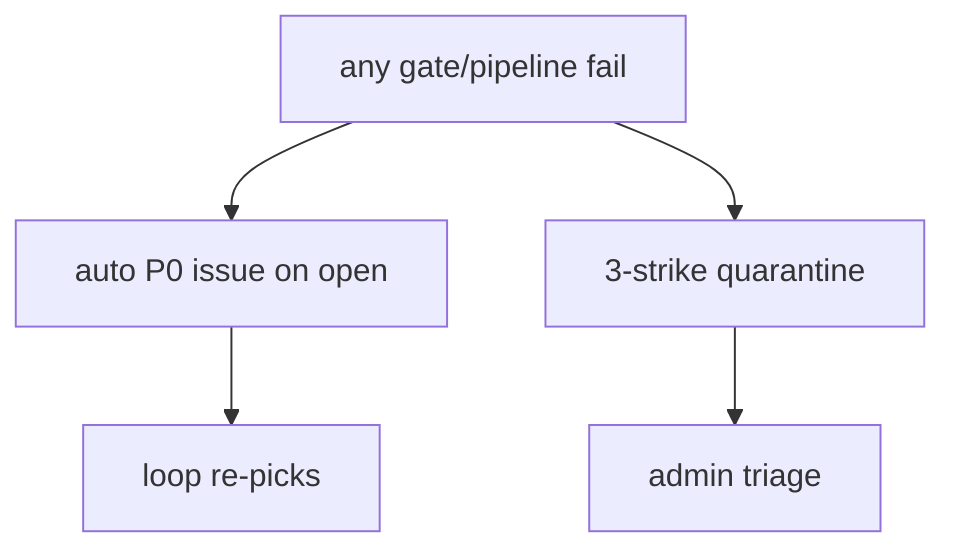
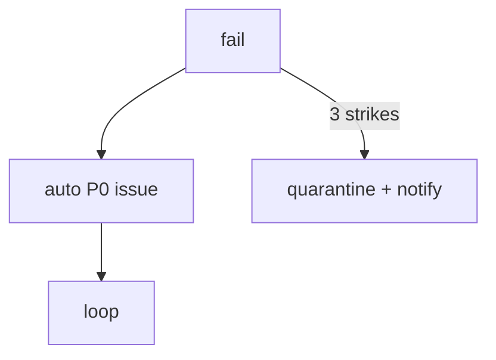

# 08 Self-Healing

## Current

```mermaid
flowchart TD
    FAIL[any gate/pipeline fail] --> P0[auto P0 issue on open]
    P0 --> LOOP[loop re-picks]
    FAIL --> Q[3-strike quarantine]
    Q --> ADMIN[admin triage]
```

## Simple

```mermaid
flowchart TD
    FAIL[fail] --> P0[auto P0 issue]
    P0 --> LOOP[loop]
    FAIL -- 3 strikes --> Q[quarantine + notify]
```
Same self-healing; only the quarantine exit is explicit instead of silent.
