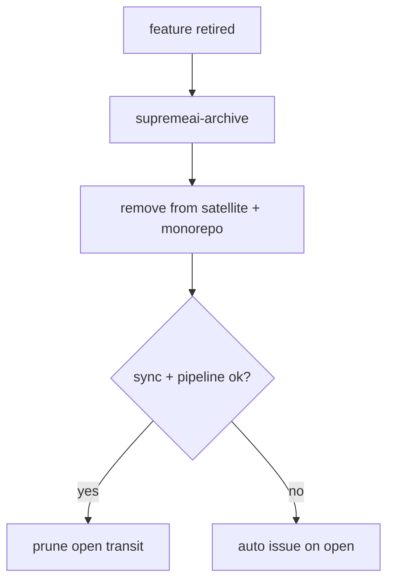
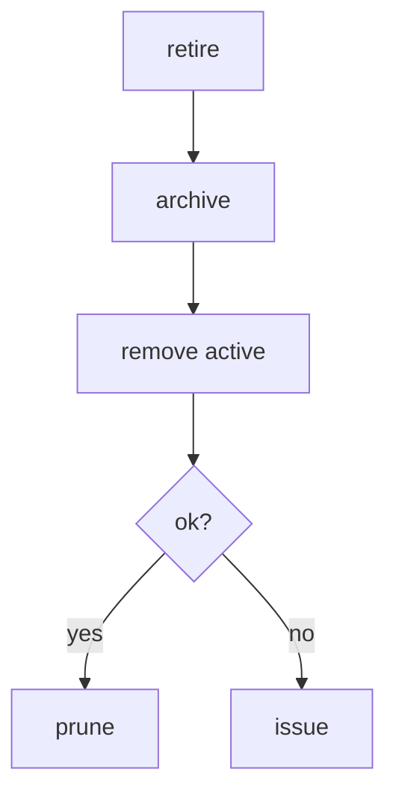

# 11 Archive & Retirement

## Current

```mermaid
flowchart TD
    RETIRE[feature retired] --> ARCH[supremeai-archive]
    ARCH --> REMOVE[remove from satellite + monorepo]
    REMOVE --> VERIFY{sync + pipeline ok?}
    VERIFY -- yes --> PRUNE[prune open transit]
    VERIFY -- no --> ISSUE[auto issue on open]
```

## Simple

```mermaid
flowchart TD
    RETIRE[retire] --> ARCH[archive] --> REMOVE[remove active] --> VERIFY{ok?}
    VERIFY -- yes --> PRUNE[prune]
    VERIFY -- no --> ISSUE[issue]
```
Same retirement; only triggered on explicit retire, not every cycle (removes per-cycle overhead).
