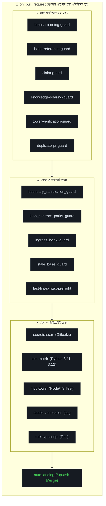

# 🔀 supremeai-open পাইপলাইন: on: pull_request (PR ভেরিফিকেশন ও অটো-ল্যান্ডিং)

এই ফাইলে `supremeai-open`-এ PR ওপেন বা আপডেট হলে যে জবগুলো চলে তা GitHub Actions UI-এর আদলে সংরক্ষণ করা হয়েছে।

---

```mermaid
flowchart LR
    classDef ghJob fill:#161b22,stroke:#30363d,stroke-width:1px,color:#c9d1d9;
    classDef ghLand fill:#161b22,stroke:#238636,stroke-width:2px,color:#3fb950;

    subgraph PR_JOBS [" 🔀 on: pull_request (শুধুমাত্র এই জবগুলো এক্সিকিউট হয়) "]
        direction TB

        subgraph FAST_GUARDS [" ১. ফাস্ট গার্ড জবস (< 2s) "]
            J1["branch-naming-guard"]
            J2["issue-reference-guard"]
            J3["claim-guard"]
            J4["knowledge-sharing-guard"]
            J5["tower-verification-guard"]
            J6["duplicate-pr-guard"]
        end

        subgraph CODE_GUARDS [" ২. কোড ও বাউন্ডারি জবস "]
            J7["boundary_sanitization_guard"]
            J8["loop_contract_parity_guard"]
            J9["ingress_hook_guard"]
            J10["stale_base_guard"]
            J11["fast-lint-syntax-preflight"]
        end

        subgraph TEST_MATRIX [" ৩. টেস্ট ও সিকিউরিটি জবস "]
            J12["secrets-scan (Gitleaks)"]
            J13["test-matrix (Python 3.11, 3.12)"]
            J14["mcp-tower (Node/TS Test)"]
            J15["studio-verification (tsc)"]
            J16["sdk-typescript (Test)"]
        end

        J17["auto-landing (Squash Merge)"]

        FAST_GUARDS --> CODE_GUARDS
        CODE_GUARDS --> TEST_MATRIX
        TEST_MATRIX --> J17
    end

    class J1,J2,J3,J4,J5,J6,J7,J8,J9,J10,J11,J12,J13,J14,J15,J16 ghJob;
    class J17 ghLand;
```

