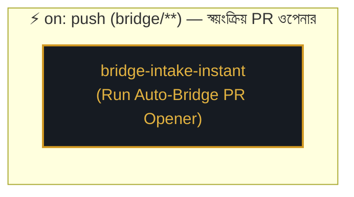

# ⚡ supremeai-open পাইপলাইন: on: push (bridge/**) (ইনস্ট্যান্ট PR ওপেনার)

এজেন্ট যখন কোনো কাজের জন্য `bridge/**` শাখায় কোড পুশ করে, তখন স্বয়ংক্রিয়ভাবে PR ওপেন করার জবটি নিচে দেওয়া হলো।

---

```mermaid
flowchart LR
    classDef ghJob fill:#161b22,stroke:#30363d,stroke-width:1px,color:#c9d1d9;
    classDef ghOrange fill:#161b22,stroke:#d29922,stroke-width:2px,color:#e3b341;

    subgraph BRIDGE_JOB [" ⚡ on: push (bridge/**) — স্বয়ংক্রিয় PR ওপেনার "]
        Job_Bridge["bridge-intake-instant<br/>(Run Auto-Bridge PR Opener)"]
    end

    class Job_Bridge ghOrange;
```

