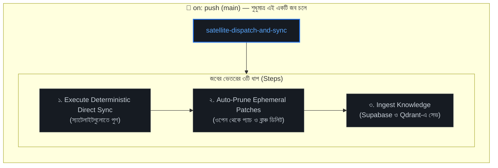

# 🚀 supremeai-open পাইপলাইন: on: push (main) (ডিসপ্যাচ, অটো-প্রুন ও ইনজেশন)

এই ফাইলে PR মার্জ হয়ে `main`-এ যাওয়ার পর যে জবটি রান হয় তা সংরক্ষণ করা হয়েছে।

---

```mermaid
flowchart LR
    classDef ghJob fill:#161b22,stroke:#30363d,stroke-width:1px,color:#c9d1d9;
    classDef ghBlue fill:#161b22,stroke:#1f6feb,stroke-width:2px,color:#58a6ff;

    subgraph MAIN_JOB [" 🚀 on: push (main) — শুধুমাত্র এই একটি জব চলে "]
        direction TB
        
        Job_Main["satellite-dispatch-and-sync"]
        
        subgraph STEPS [" জবের ভেতরের ৩টি ধাপ (Steps) "]
            direction LR
            S1["১. Execute Deterministic Direct Sync<br/>(স্যাটেলাইটগুলোতে পুশ)"]
            S2["২. Auto-Prune Ephemeral Patches<br/>(ওপেন থেকে প্যাচ ও ব্রাঞ্চ ডিলিট)"]
            S3["৩. Ingest Knowledge<br/>(Supabase ও Qdrant-এ সেভ)"]
            S1 --> S2 --> S3
        end

        Job_Main --> STEPS
    end

    class Job_Main ghBlue;
    class S1,S2,S3 ghJob;
```

