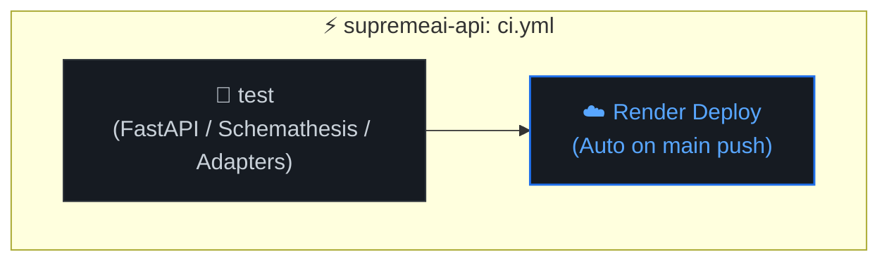

# ⚡ supremeai-api পাইপলাইন (ci.yml)

- **ইভেন্ট:** `push` (main) এবং `pull_request`
- **জবস:** `test` (FastAPI, Schemathesis Fuzz, Provider Adapters & Route Tests)

```mermaid
flowchart LR
    classDef ghJob fill:#161b22,stroke:#30363d,stroke-width:1px,color:#c9d1d9;
    classDef ghDeploy fill:#161b22,stroke:#1f6feb,stroke-width:1.5px,color:#58a6ff;

    subgraph API_PIPELINE [" ⚡ supremeai-api: ci.yml "]
        direction LR
        J_Test["🧪 test<br/>(FastAPI / Schemathesis / Adapters)"]
        J_Deploy["☁️ Render Deploy<br/>(Auto on main push)"]

        J_Test --> J_Deploy
    end

    class J_Test ghJob;
    class J_Deploy ghDeploy;
```
