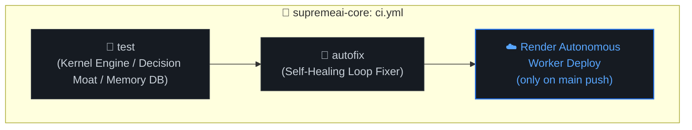

# 🧠 supremeai-core পাইপলাইন (ci.yml)

- **ইভেন্ট:** `push` (main) এবং `pull_request`
- **জবস:** `test` (Agent Kernel, Decision Moat & Memory) এবং `autofix` (লুপ এরর হিলিং)

```mermaid
flowchart LR
    classDef ghJob fill:#161b22,stroke:#30363d,stroke-width:1px,color:#c9d1d9;
    classDef ghDeploy fill:#161b22,stroke:#1f6feb,stroke-width:1.5px,color:#58a6ff;

    subgraph CORE_PIPELINE [" 🧠 supremeai-core: ci.yml "]
        direction LR
        J_Test["🧪 test<br/>(Kernel Engine / Decision Moat / Memory DB)"]
        J_Autofix["🔧 autofix<br/>(Self-Healing Loop Fixer)"]
        J_Deploy["☁️ Render Autonomous Worker Deploy<br/>(only on main push)"]

        J_Test --> J_Autofix
        J_Autofix --> J_Deploy
    end

    class J_Test,J_Autofix ghJob;
    class J_Deploy ghDeploy;
```
