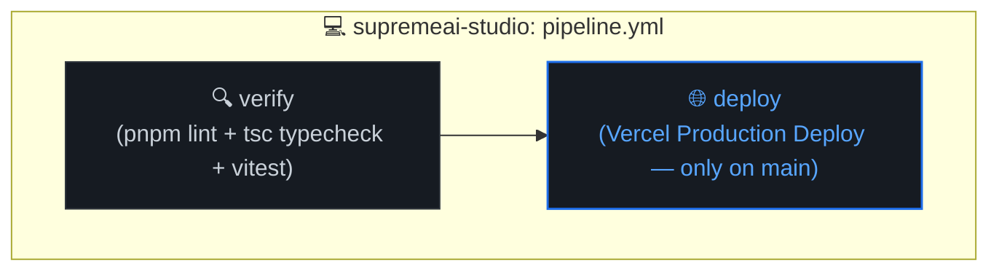

# 💻 supremeai-studio পাইপলাইন (pipeline.yml)

- **ইভেন্ট:** `push` (main) এবং `pull_request`
- **জবস:** `verify` (pnpm lint, typecheck, component test) ➔ `deploy` (Vercel Production Deploy)

```mermaid
flowchart LR
    classDef ghJob fill:#161b22,stroke:#30363d,stroke-width:1px,color:#c9d1d9;
    classDef ghDeploy fill:#161b22,stroke:#1f6feb,stroke-width:1.5px,color:#58a6ff;

    subgraph STUDIO_PIPELINE [" 💻 supremeai-studio: pipeline.yml "]
        direction LR
        J_Verify["🔍 verify<br/>(pnpm lint + tsc typecheck + vitest)"]
        J_Deploy["🌐 deploy<br/>(Vercel Production Deploy — only on main)"]

        J_Verify --> J_Deploy
    end

    class J_Verify ghJob;
    class J_Deploy ghDeploy;
```
