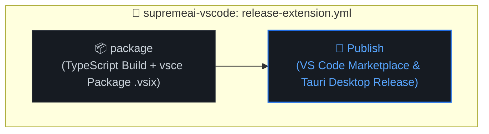

# 🧩 supremeai-vscode পাইপলাইন (release-extension.yml)

- **ইভেন্ট:** `push` (tags / main) এবং `workflow_dispatch`
- **জবস:** `package` (vsce প্যাকেজিং, VSIX রিলিজ ও পাবলিশিং)

```mermaid
flowchart LR
    classDef ghJob fill:#161b22,stroke:#30363d,stroke-width:1px,color:#c9d1d9;
    classDef ghDeploy fill:#161b22,stroke:#1f6feb,stroke-width:1.5px,color:#58a6ff;

    subgraph VSCODE_PIPELINE [" 🧩 supremeai-vscode: release-extension.yml "]
        direction LR
        J_Package["📦 package<br/>(TypeScript Build + vsce Package .vsix)"]
        J_Publish["🛒 Publish<br/>(VS Code Marketplace & Tauri Desktop Release)"]

        J_Package --> J_Publish
    end

    class J_Package ghJob;
    class J_Publish ghDeploy;
```
