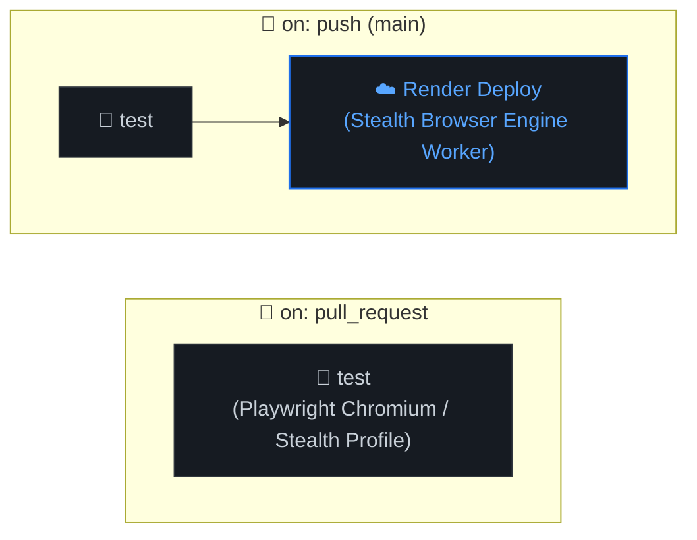

# 🕷️ supremeai-browser পাইপলাইন আর্কিটেকচার

- **ফাইল:** `.github/workflows/ci.yml`
- **ইভেন্ট:** `pull_request` এবং `push (main)`

```mermaid
flowchart LR
    classDef ghJob fill:#161b22,stroke:#30363d,stroke-width:1px,color:#c9d1d9;
    classDef ghDeploy fill:#161b22,stroke:#1f6feb,stroke-width:1.5px,color:#58a6ff;

    subgraph PR_EVENT [" 🔀 on: pull_request "]
        direction LR
        J_TestPR["🧪 test<br/>(Playwright Chromium / Stealth Profile)"]
    end

    subgraph MAIN_EVENT [" 🚀 on: push (main) "]
        direction LR
        J_TestMain["🧪 test"] --> J_Deploy["☁️ Render Deploy<br/>(Stealth Browser Engine Worker)"]
    end

    class J_TestPR,J_TestMain ghJob;
    class J_Deploy ghDeploy;
```

