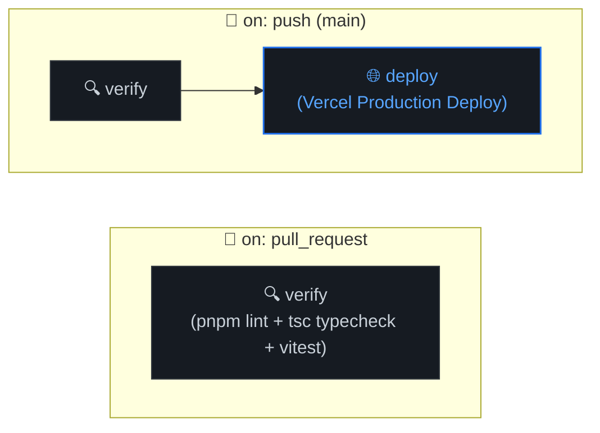

# 💻 supremeai-studio পাইপলাইন আর্কিটেকচার

- **ফাইল:** `.github/workflows/pipeline.yml`
- **ইভেন্ট:** `pull_request` এবং `push (main)`

```mermaid
flowchart LR
    classDef ghJob fill:#161b22,stroke:#30363d,stroke-width:1px,color:#c9d1d9;
    classDef ghDeploy fill:#161b22,stroke:#1f6feb,stroke-width:1.5px,color:#58a6ff;

    subgraph PR_EVENT [" 🔀 on: pull_request "]
        direction LR
        J_VerifyPR["🔍 verify<br/>(pnpm lint + tsc typecheck + vitest)"]
    end

    subgraph MAIN_EVENT [" 🚀 on: push (main) "]
        direction LR
        J_VerifyMain["🔍 verify"] --> J_Deploy["🌐 deploy<br/>(Vercel Production Deploy)"]
    end

    class J_VerifyPR,J_VerifyMain ghJob;
    class J_Deploy ghDeploy;
```

