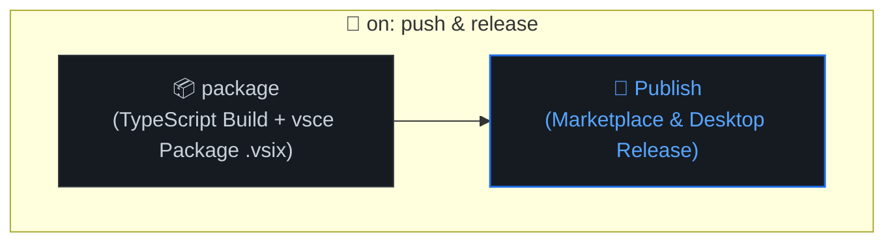

# 🧩 supremeai-vscode পাইপলাইন আর্কিটেকচার

- **ফাইল:** `.github/workflows/release-extension.yml`
- **ইভেন্ট:** `push (main / tags)` ও `workflow_dispatch`

```mermaid
flowchart LR
    classDef ghJob fill:#161b22,stroke:#30363d,stroke-width:1px,color:#c9d1d9;
    classDef ghDeploy fill:#161b22,stroke:#1f6feb,stroke-width:1.5px,color:#58a6ff;

    subgraph VSCODE_FLOW [" 🚀 on: push & release "]
        direction LR
        J_Package["📦 package<br/>(TypeScript Build + vsce Package .vsix)"]
        J_Publish["🛒 Publish<br/>(Marketplace & Desktop Release)"]

        J_Package --> J_Publish
    end

    class J_Package ghJob;
    class J_Publish ghDeploy;
```

