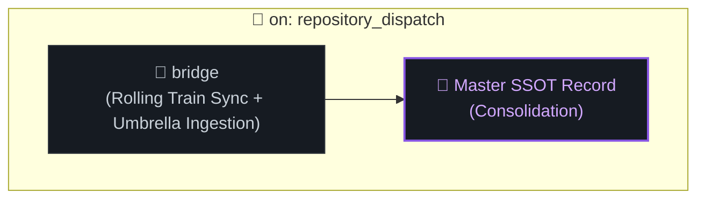

# 👑 supremeai (Master Monorepo) পাইপলাইন আর্কিটেকচার

- **ফাইল:** `.github/workflows/bridge-intake.yml`
- **ইভেন্ট:** `repository_dispatch` ও `workflow_dispatch`

```mermaid
flowchart LR
    classDef ghJob fill:#161b22,stroke:#30363d,stroke-width:1px,color:#c9d1d9;
    classDef ghMaster fill:#161b22,stroke:#8957e5,stroke-width:2px,color:#d2a8ff;

    subgraph MASTER_FLOW [" 👑 on: repository_dispatch "]
        direction LR
        J_Bridge["🚂 bridge<br/>(Rolling Train Sync + Umbrella Ingestion)"]
        J_Record["👑 Master SSOT Record<br/>(Consolidation)"]

        J_Bridge --> J_Record
    end

    class J_Bridge ghJob;
    class J_Record ghMaster;
```

