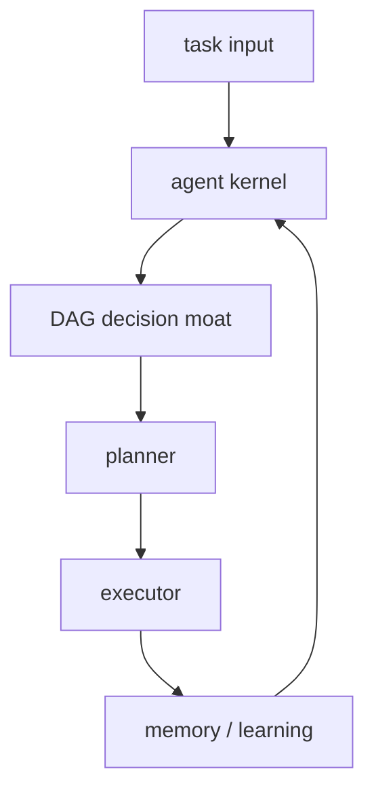
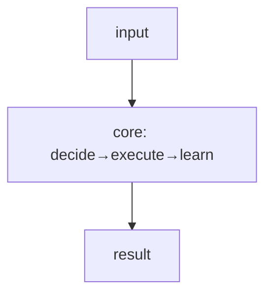

# supremeai-core (Decision Moat)

## Current

```mermaid
flowchart TD
    INPUT[task input] --> KERNEL[agent kernel]
    KERNEL --> DAG[DAG decision moat]
    DAG --> PLAN[planner]
    PLAN --> EXEC[executor]
    EXEC --> MEM[memory / learning]
    MEM --> KERNEL
```

## Simple

```mermaid
flowchart TD
    IN[input] --> CORE[core: decide→execute→learn]
    CORE --> OUT[result]
```
Same kernel→DAG→plan→exec→learn loop, collapsed to one core node externally.
