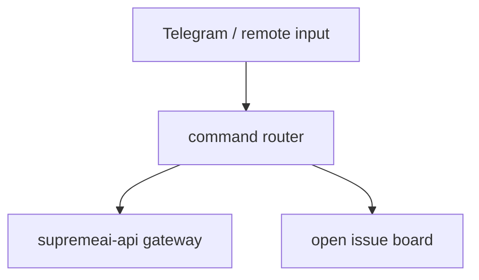
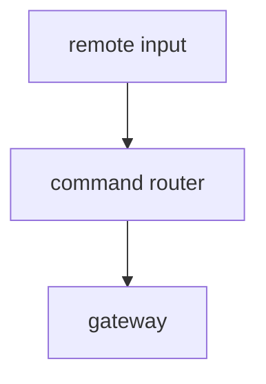

# supremeai-command (Remote Dispatch)

## Current

```mermaid
flowchart TD
    TG[Telegram / remote input] --> CMD[command router]
    CMD --> GW[supremeai-api gateway]
    CMD --> OPEN[open issue board]
```

## Simple

```mermaid
flowchart TD
    IN[remote input] --> CMD[command router]
    CMD --> GW[gateway]
```
Same router; board interaction handled by the loop, not command.
