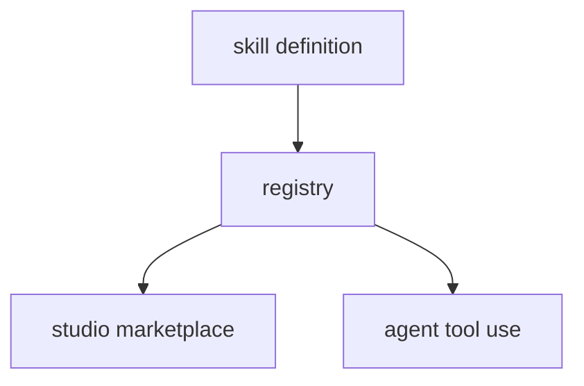
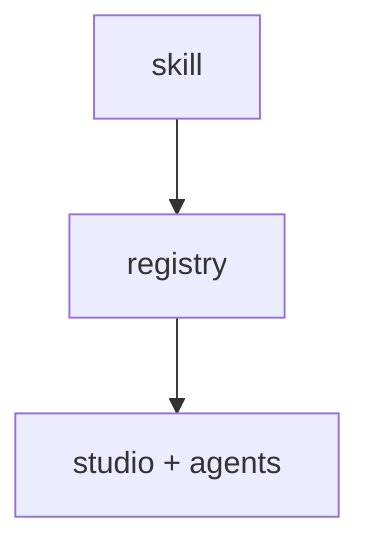

# supremeai-skills (Tools Registry)

## Current

```mermaid
flowchart TD
    SKILL[skill definition] --> REG[registry]
    REG --> STUDIO[studio marketplace]
    REG --> AGENT[agent tool use]
```

## Simple

```mermaid
flowchart TD
    SKILL[skill] --> REG[registry]
    REG --> CONSUMER[studio + agents]
```
Same registry; consumers collapsed into one node.
