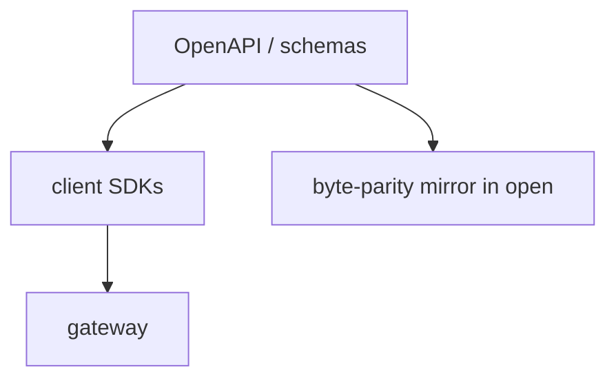
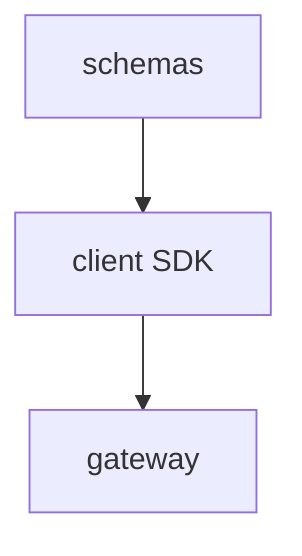

# supremeai-sdk (Contracts)

## Current

```mermaid
flowchart TD
    SCHEMA[OpenAPI / schemas] --> CLIENT[client SDKs]
    CLIENT --> GW[gateway]
    SCHEMA --> MIRROR[byte-parity mirror in open]
```

## Simple

```mermaid
flowchart TD
    SCHEMA[schemas] --> SDK[client SDK]
    SDK --> GW[gateway]
```
Same contract flow; mirror check is CI-internal.
