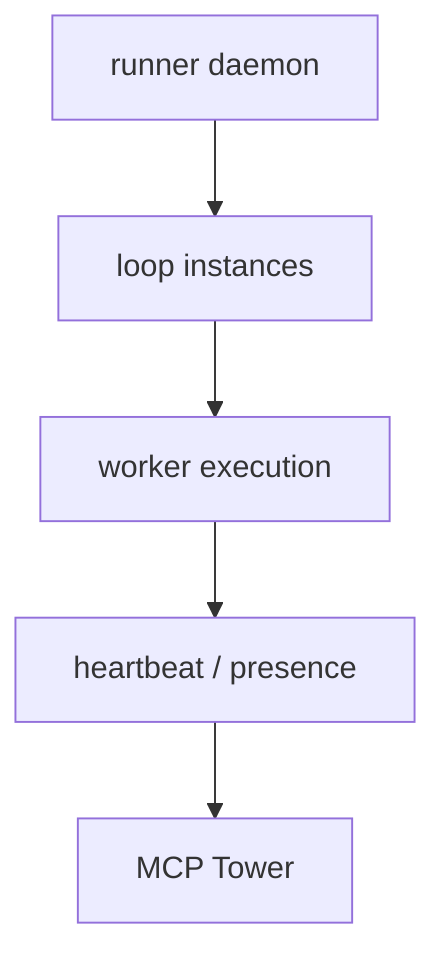
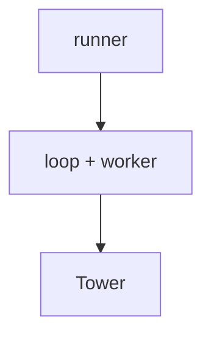

# supremeai-agents (Runner)

## Current

```mermaid
flowchart TD
    DAEMON[runner daemon] --> LOOP[loop instances]
    LOOP --> WORKER[worker execution]
    WORKER --> HB[heartbeat / presence]
    HB --> TOWER[MCP Tower]
```

## Simple

```mermaid
flowchart TD
    RUNNER[runner] --> LOOP[loop + worker]
    LOOP --> TOWER[Tower]
```
Same runner→loop→worker; heartbeat folded into worker node.
